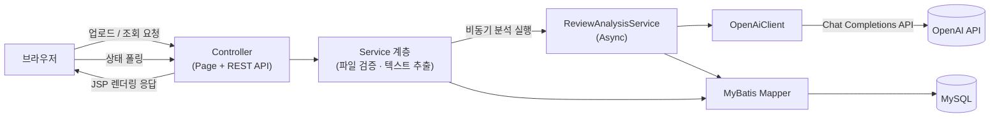

# AI 이력서/자기소개서 첨삭 서비스


OpenAI 기반으로 이력서·자기소개서를 자동 분석해 직무적합성 / 논리성 / 문장력 / 오탈자 4개 항목의 점수와 총평, 구체적인 수정 제안을 제공하는 웹 서비스입니다. PDF·DOCX 파일을 업로드하면 텍스트를 추출해 AI가 첨삭하고, 결과를 웹 화면에서 바로 확인하거나 PDF로 다운로드해 보관할 수 있습니다.

## 주요 기능

- 이력서/자기소개서 PDF·DOCX 파일 업로드 및 텍스트 추출 (PDFBox, Apache POI)
- OpenAI 기반 4개 항목(직무적합성 · 논리성 · 문장력 · 오탈자) 점수 분석 및 총평 생성
- 원문에서 수정이 필요한 부분을 하이라이트한 첨삭 결과 화면
- 원문 → 수정 제안 → 이유 형태의 구체적인 수정 제안 (건당 3~6개)
- 분석 이력 목록 조회 (페이지네이션)
- 첨삭 결과를 한글 폰트가 내장된 PDF로 다운로드

## 기술 스택

| 영역 | 기술 |
| --- | --- |
| 언어 / 프레임워크 | Java 17, Spring Boot 4.0.8 (WAR, embedded Tomcat) |
| 뷰 | JSP + JSTL |
| 영속성 | MyBatis + MySQL |
| 파일 처리 | Apache PDFBox (PDF 추출/생성), Apache POI (DOCX 추출) |
| 빌드 | Gradle |
| AI 연동 | OpenAI Chat Completions API (`gpt-4o-mini`) |

## 아키텍처



업로드 요청은 파일 저장과 텍스트 추출까지만 동기로 처리하고, OpenAI 분석은 `@Async`로 별도 스레드에서 수행해 응답을 지연시키지 않습니다. 클라이언트는 `GET /api/reviews/{fileId}/status`를 폴링해 분석 상태(`ANALYZING` / `DONE` / `FAILED`)를 확인합니다.

## 프로젝트 구조

```
src/main/java/com/example/aireview/
├── AiReviewApplication.java      # Spring Boot 진입점
├── ServletInitializer.java       # WAR 배포 지원
├── config/                       # AppConfig, AsyncConfig, FileStorageProperties, OpenAiProperties, RestTemplateConfig
├── controller/                   # ReviewPageController (JSP 페이지 라우팅)
├── controller/api/               # FileUploadController, ReviewStatusController, ReviewDownloadController (REST API)
├── domain/                       # ResumeFile, ResumeText, Feedback, Suggestion (MyBatis 엔티티)
├── dto/                          # ApiErrorResponse, ReviewHistoryItem, ReviewStatusResponse, UploadResponse
├── dto/openai/                   # OpenAI 요청/응답 DTO
├── exception/                    # 커스텀 예외 + GlobalExceptionHandler
├── mapper/                       # MyBatis 매퍼 인터페이스
└── service/                      # 파일 저장/검증, 텍스트 추출, AI 분석, PDF 생성 등 비즈니스 로직

src/main/resources/
├── application.yml               # 공통 설정 (커밋됨)
├── application-secret.yml        # DB/OpenAI 시크릿 (git-ignored, 직접 생성 필요)
├── mappers/*.xml                 # MyBatis SQL 매퍼
└── fonts/NanumGothic-Regular.ttf # PDF 한글 출력용 폰트

src/main/webapp/WEB-INF/views/    # upload.jsp, result.jsp, history.jsp
```

## 시작하기

### 사전 요구사항

- JDK 17
- MySQL (로컬 또는 원격 인스턴스)
- OpenAI API 키 ([platform.openai.com](https://platform.openai.com/api-keys)에서 발급)

### 1. 데이터베이스 준비

MySQL에 데이터베이스를 생성합니다. 테이블 스키마 파일은 저장소에 포함되어 있지 않으므로, `src/main/resources/mappers/*.xml`에서 참조하는 컬럼을 기준으로 `resume_file`, `resume_text`, `feedback`, `suggestion` 테이블을 직접 생성해야 합니다.

```sql
CREATE DATABASE aireview CHARACTER SET utf8mb4;
```

### 2. 환경변수 / 시크릿 설정

DB 접속 정보와 OpenAI API 키는 `application-secret.yml`에 두며, 이 파일은 민감정보 보호를 위해 `.gitignore`에 등록되어 저장소에 포함되어 있지 않습니다. 아래 내용으로 `src/main/resources/application-secret.yml` 파일을 직접 생성하세요.

```yaml
spring:
  datasource:
    url: jdbc:mysql://localhost:3306/aireview
    username: <DB 계정>
    password: <DB 비밀번호>
    driver-class-name: com.mysql.cj.jdbc.Driver

openai:
  api-key: <OpenAI API 키>
```

`application.yml`의 `spring.profiles.include: secret` 설정에 의해 이 파일이 자동으로 로드됩니다.

### 3. 실행

```bash
# Windows
gradlew.bat bootRun

# macOS / Linux
./gradlew bootRun
```

실행 후 브라우저에서 `http://localhost:8080/upload`로 접속합니다.

```bash
./gradlew build   # WAR 빌드
./gradlew test    # 테스트 실행
```

## 주요 화면 / API

### 페이지

| 경로 | 설명 |
| --- | --- |
| `GET /` | `/upload`로 리다이렉트 |
| `GET /upload` | 파일 업로드 화면 |
| `GET /reviews/{fileId}` | 첨삭 결과 화면 (항목별 점수, 원문 하이라이트, 수정 제안) |
| `GET /reviews` | 분석 이력 목록 (페이지네이션) |

### REST API

| 메서드 / 경로 | 설명 |
| --- | --- |
| `POST /api/files` | 이력서/자기소개서 업로드, 텍스트 추출 및 비동기 AI 분석 시작 |
| `GET /api/reviews/{fileId}/status` | 분석 상태 조회 (`ANALYZING` / `DONE` / `FAILED`) |
| `GET /api/reviews/{fileId}/pdf` | 첨삭 결과 PDF 다운로드 |

## 담당 역할

1인 개인 프로젝트로, 기획부터 설계(아키텍처), 백엔드 구현(Spring Boot, MyBatis), OpenAI 연동, PDF/DOCX 파일 처리, 프론트엔드(JSP) 구현까지 전 과정을 단독으로 진행했습니다.

## 참고

- `src/main/resources/application-secret.yml`, `uploads/` 디렉터리는 민감정보 및 업로드 파일 보호를 위해 git에서 제외되어 있습니다.
- 파일 업로드 용량 제한은 20MB이며, `pdf`, `docx` 확장자만 허용됩니다.
